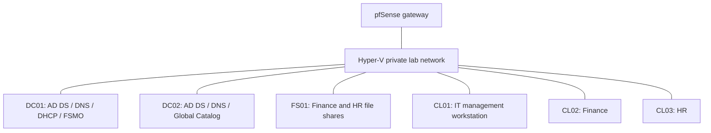

# Active Directory Deployment Lab

A hands-on Windows domain deployment demonstrating AD DS, DNS, DHCP, Group Policy, departmental file access, and delegated administration on Hyper-V.

**Status:** Core domain deployment and two-way replication on October 5, 2026. Remaining infrastructure checks are tracked in the [deployment checklist](docs/roadmap.md).

## What this project demonstrates

- Deploy a Windows Server 2025 forest and a second writable domain controller.
- Configure AD-integrated DNS, Windows DHCP, and domain-joined Windows 11 clients.
- Organize users, computers, and groups into OUs; apply workstation and user policies.
- Use AGDLP groups, share/NTFS permissions, and group-targeted drive mappings.
- Separate daily-use and administrative identities; delegate password reset and account unlock.
- Troubleshoot DNS-related replication failures and validate directory services, time, and authentication.

## Environment

The lab uses `n3m0.test` on `10.50.10.0/24`. Both domain controllers run on one Hyper-V host. DHCP runs on DC01 and supplies both domain DNS servers. See the [architecture](docs/architecture.md) for addressing and configuration.

## Validation highlights

| Area | Demonstrated result | Evidence |
|---|---|---|
| AD replication | All five naming contexts replicated both ways; final summary showed zero failures | [DC02 deployment](docs/dc02-build.md) |
| AD-integrated DNS | Test record creation and deletion propagated between both DNS servers | [DC02 deployment](docs/dc02-build.md) |
| Domain controller services | Basic DNS, Advertising, SYSVOL/NETLOGON passed; SYSVOL DFSR State 4 on both | [DC02 deployment](docs/dc02-build.md) |
| Authentication | Standard user obtained fresh Kerberos tickets issued by DC02; user policy refresh succeeded | [Client configuration](docs/windows-clients-build.md) |
| DHCP and clients | Three clients joined the domain; CL01 renewed and received both DNS servers | [Network services](docs/firewall-dhcp-build.md) |
| Delegated administration | Password reset and unlock succeeded; unauthorized user creation/group changes were denied | [Identity and delegation](docs/windows-clients-build.md) |
| Departmental access | File operations, cross-department denial, and automatic drive recreation passed per operator | [File server deployment](docs/fs01-build.md) |

Evidence consists of reviewed session screenshots and operator reports, distinguished in the journals. Raw screenshots and credentials are not committed.

## Explore the build

1. [Deployment checklist and remaining work](docs/roadmap.md)
2. [Network and domain architecture](docs/architecture.md)
3. [DC01: forest deployment and initial backup](docs/dc01-build.md)
4. [Firewall, DNS forwarding, and DHCP](docs/firewall-dhcp-build.md)
5. [Windows clients, OUs, Group Policy, and delegation](docs/windows-clients-build.md)
6. [FS01: departmental permissions and mapped drives](docs/fs01-build.md)
7. [DC02: replication troubleshooting and validation](docs/dc02-build.md)

Supporting records: [inventory](docs/inventory.md), [recovery limits](docs/recovery.md), [documentation workflow](docs/documentation.md), and [change log](CHANGELOG.md).

## Scope and limitations

This repository covers domain deployment, configuration, and administration. Penetration testing, endpoint detection/response, and AI application security belong to separate follow-on projects described in the [project series](docs/project-series.md).

Full DC01 outage failover has not been tested. Both DCs share one host; DHCP has no failover partner. DC01 has a local guest backup, with no restore test or off-host protection verified. DC02 updates and ISO ejection were confirmed by the operator on October 6, 2026; external DNS resolution and its pfSense forwarder configuration were verified. Broader network-isolation checks remain open. An unresolved local ADUC status label on DC01 is documented alongside successful service and replication checks.

The environment is an authorized disposable lab. Windows activation is intentionally outside project scope.
