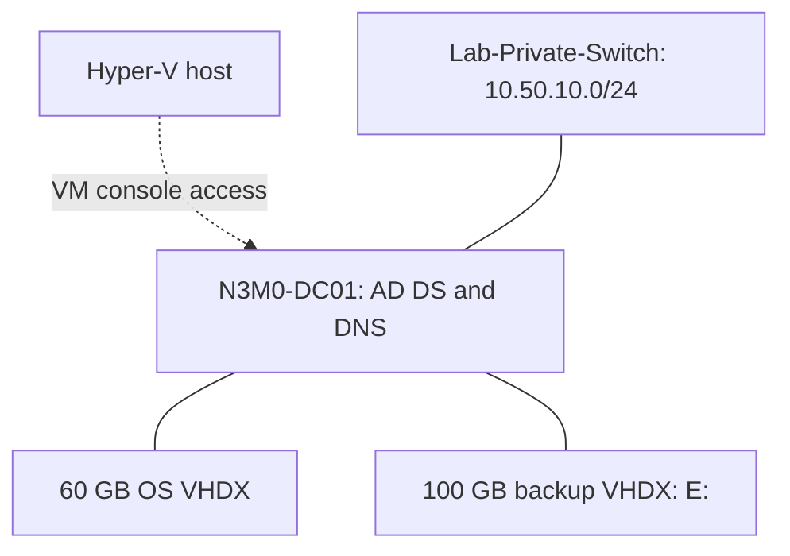
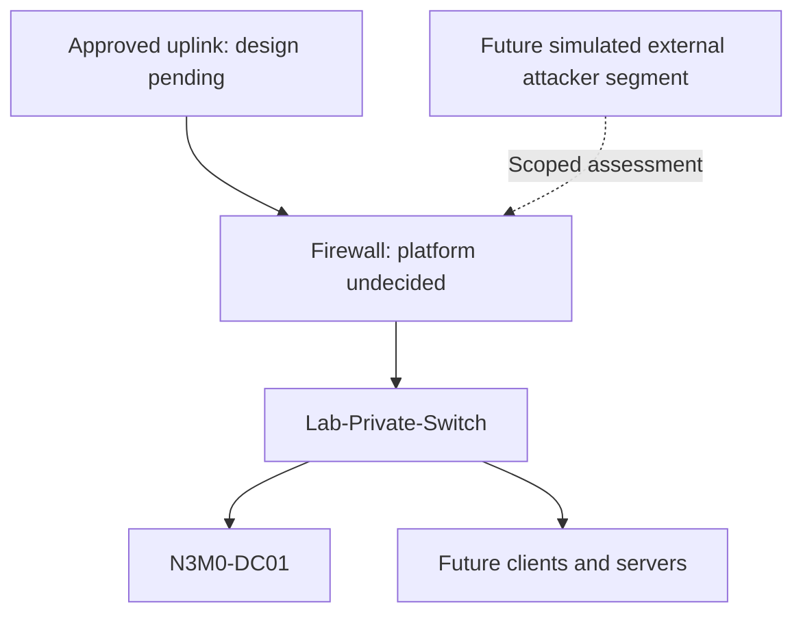

# Current and planned architecture

Updated 2026-09-10. Current and proposed components are separated below.

## Deployed

All project workloads currently run on the authorized Hyper-V test server. Management uses the existing host access and VM consoles.

Console access is not an IP route. A private switch does not provide host-to-guest network access or internet connectivity. Both VHDX files reside on the same host storage; the backup is not an independent failure domain.

## Address plan

| Device/purpose | Address | State |
|---|---|---|
| Network | 10.50.10.0/24; mask 255.255.255.0 | Selected |
| Firewall LAN / future gateway | 10.50.10.1 | Reserved; not deployed |
| N3M0-DC01 | 10.50.10.10 | Configured |
| Future DC02 | 10.50.10.11 | Reserved |
| Future file server | 10.50.10.20 | Reserved |
| Future DHCP client pool | 10.50.10.100–10.50.10.199 | Planned; no DHCP scope exists |

DC01's gateway is blank. Preferred DNS is 10.50.10.10; alternate DNS is blank. IPv6 remains enabled with automatic settings. Forest/domain: n3m0.test; NetBIOS: N3M0. Forest and domain functional levels: Windows Server 2025. Future DCs must support that functional level.

## Next network phase — not deployed

Select the firewall platform before provisioning. OPNsense and pfSense CE are candidates, not approved selections. Validate current Hyper-V compatibility, release notes, and sizing at installation time.

Before enabling an uplink, record the host network and recovery access, check address overlap, define denial of company/client and other protected networks, and allow only required destinations. Test the policy in both directions. Keep lab DHCP confined to its segment. Do not put targets directly on an external switch. A second attacker segment can simulate external penetration testing without publishing services to the internet.

## Resource plan

| Workload | vCPU | RAM | Disk | State |
|---|---:|---:|---:|---|
| N3M0-DC01 | 2 | 4 GB | 60 GB OS + 100 GB backup | Deployed |
| Firewall | TBD | TBD | TBD | Platform and sizing pending |
| DC02 | 2 | 4 GB | 80 GB | Proposed |
| FS01 | 2 | 4 GB | 150 GB | Proposed |
| IT-ADMIN | 2 | 4 GB | 80 GB | Proposed |
| CLIENT01 / CLIENT02, each | 2 | 4 GB | 80 GB | Proposed |
| Kali / attacker VM | 4 | 4 GB | 80 GB | Placement and sizing proposed |
| Wazuh | 4 | 8 GB | 200 GB | Prior sizing proposal; inspect existing VM first |

Hyper-V settings screenshots show 20 processors for DC01. No reduction is recorded. Do not treat the old nine-VM totals as current allocations. The original firewall estimate of 2 GB RAM requires replacement after platform selection.

Preserve existing shared guests. Start workloads in phases, measure utilization, and add CLIENT03/04 only if resources permit. Defer Security Onion and local AI model hosting.
