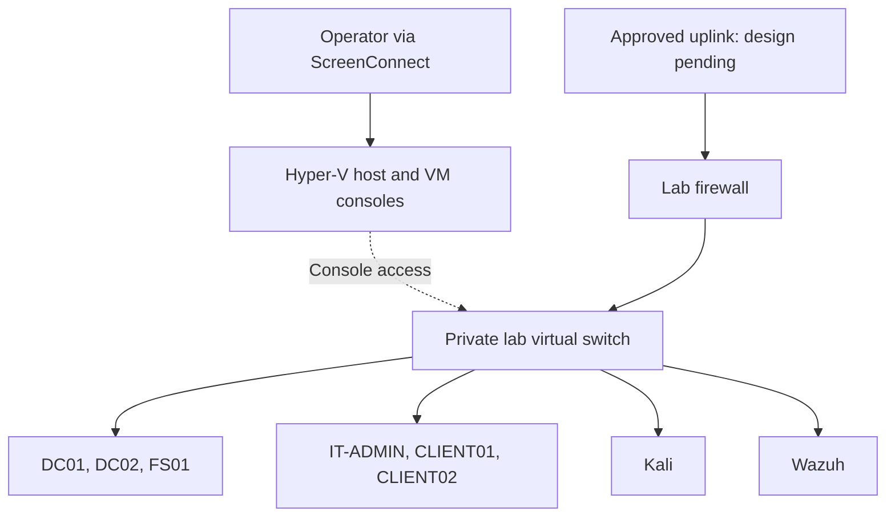

# Proposed architecture

**Status: design only. No switches, firewall rules, or VMs have been created for this project.**

Keep Kali, Windows clients, and infrastructure on Hyper-V. Begin remote access through the existing host ScreenConnect connection and VM consoles.

## Network concept

Console access is a management path, not an IP route shown by the dashed link. A private lab switch is proposed to keep guest traffic separate from the host's network. The firewall uplink method, address space, DNS, and rules remain undecided.

Before enabling any uplink, define explicit denial of lab access to company/client networks and permit only required destinations. Validate isolation using agreed test destinations. Keep lab DHCP confined to the lab. Do not attach attack targets directly to an external switch. An external switch alone does not provide isolation.

## Starting VM budget

| VM | Role | vCPU | RAM (GiB) | Virtual disk (GiB) |
|---|---|---:|---:|---:|
| Lab firewall | Routing and traffic control | 2 | 2 | 32 |
| DC01 | AD DS and DNS | 2 | 4 | 80 |
| DC02 | Additional domain controller | 2 | 4 | 80 |
| FS01 | File shares and permissions | 2 | 4 | 150 |
| IT-ADMIN | Administrative Windows client | 2 | 4 | 80 |
| CLIENT01 | Employee Windows client | 2 | 4 | 80 |
| CLIENT02 | Employee Windows client | 2 | 4 | 80 |
| Kali | Authorized lab assessment | 4 | 4 | 80 |
| Wazuh | Security monitoring | 4 | 8 | 200 |
| **Total: 9 VMs** | | **22** | **38** | **862** |

Correction to the initial chat estimate: vCPUs sum to **22**, not 24. Allocations are planning estimates, not validated product requirements. Validate current OS/tool requirements and Windows guest licensing before provisioning. Verify Windows 11 VM prerequisites during its build phase.

At the observed 55 GiB free, 38 GiB guest RAM would leave roughly 17 GiB before additional overhead or coworker activity. This is not guaranteed spare capacity. Start in phases and monitor actual utilization. Thin/dynamic disks still need sufficient future capacity; checkpoints and logs add consumption.

Review the existing Wazuh VM before creating another. Do not repurpose shared VMs without establishing ownership and recovery needs.

## Growth

Add CLIENT03/04 on demand after measuring usage. Defer Security Onion and local AI model hosting. Begin AI security later with a small test application and a model endpoint selected for resource and data-handling requirements. A GPU/local model is not part of the initial build.

## Decisions still needed

Firewall product, domain name, subnet, VM naming details, uplink implementation, update access, backup location, and remote guest access remain open.
