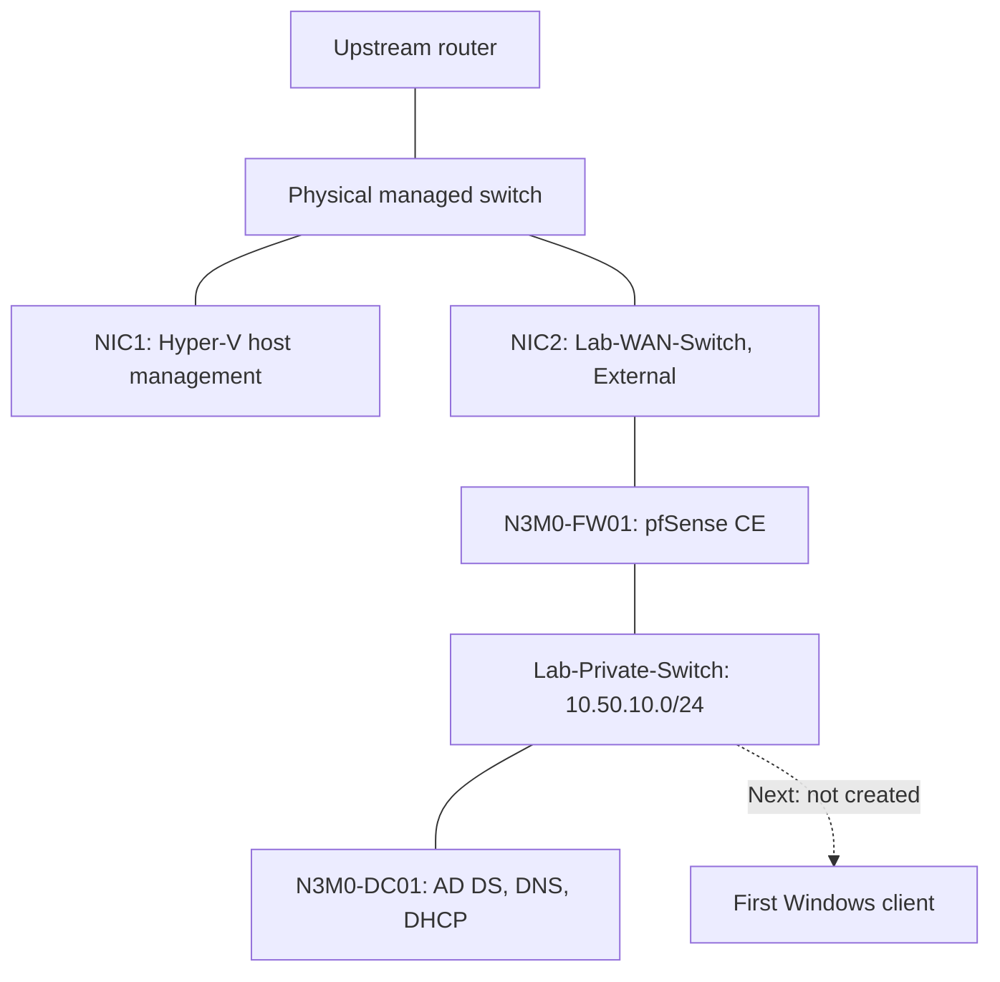

# Current and planned architecture

Updated 2026-09-11. Results are based on session screenshots and operator reports.

## Deployed

Host sharing is disabled on Lab-WAN-Switch. NIC1 remains the host management connection; NIC2 is dedicated to the firewall uplink through the existing physical switch. No direct cable to the router was needed. Lab targets attach only to the private switch. Hyper-V console access remains available independently of guest IP connectivity.

## Address plan

| Device/purpose | Address | State |
|---|---|---|
| Lab network | 10.50.10.0/24; mask 255.255.255.0 | Deployed |
| N3M0-FW01 LAN / gateway | 10.50.10.1 | Configured |
| N3M0-FW01 WAN | DHCP on upstream network | Lease observed; not a static reservation |
| N3M0-DC01 | 10.50.10.10 | Configured |
| Future DC02 | 10.50.10.11 | Reserved |
| Future file server | 10.50.10.20 | Reserved |
| N3M0-Clients DHCP pool | 10.50.10.100–10.50.10.199 | Configured; client lease test pending |

DC01 uses gateway 10.50.10.1 and preferred DNS 10.50.10.10, with alternate DNS blank. Its DNS forwarder is 10.50.10.1. Domain/forest: n3m0.test; NetBIOS: N3M0; functional levels: Windows Server 2025. The previously recorded guest IPv6 configuration remains enabled; the pfSense default IPv6 LAN allow rule is disabled.

## Firewall policy and validation

LAN rules, in order: anti-lockout; allow TCP/UDP DNS from LAN subnets to LAN address; block/log LAN traffic to PRIVATE_NETWORKS; default IPv4 allow; disabled default IPv6 allow. PRIVATE_NETWORKS contains 10.0.0.0/8, 172.16.0.0/12, and 192.168.0.0/16.

The DNS allowance must precede the private-address block. The block affects routed traffic and traffic to private firewall addresses unless explicitly allowed; it does not filter communication directly between guests in the same subnet.

DC01 external DNS and outbound TCP 443 passed. Firewall logs showed the test ICMP traffic from DC01 to the upstream router blocked by the named private-network rule. This is evidence for that tested path, not comprehensive segmentation or reverse-direction validation. Future inter-subnet services require explicit policy review.

## Resource plan

| Workload | vCPU | RAM | Disk | State |
|---|---:|---:|---:|---|
| N3M0-DC01 | 2 | 4 GB | 60 GB OS + 100 GB backup | Deployed |
| N3M0-FW01 | 2 | 4 GB fixed | 32 GB | Deployed following guided configuration |
| DC02 | 2 | 4 GB | 80 GB | Proposed |
| FS01 | 2 | 4 GB | 150 GB | Proposed |
| IT-ADMIN | 2 | 4 GB | 80 GB | Proposed; not created |
| CLIENT01 / CLIENT02, each | 2 | 4 GB | 80 GB | Proposed; not created |
| Kali / attacker VM | 4 | 4 GB | 80 GB | Placement and sizing proposed |
| Wazuh | 4 | 8 GB | 200 GB | Prior sizing proposal; inspect existing VM first |

All current project workloads run on the Hyper-V test server. Preserve retained ninjatest, VulScan, and Wazuh guests. Start workloads in phases and measure utilization. DC01's 2-vCPU correction was confirmed on 2026-09-10; older 20-vCPU observations are historical.

A simulated external attacker segment remains a later option. No public service exposure is needed.

See [firewall and DHCP journal](firewall-dhcp-build.md) for settings, tests, and the next step.
