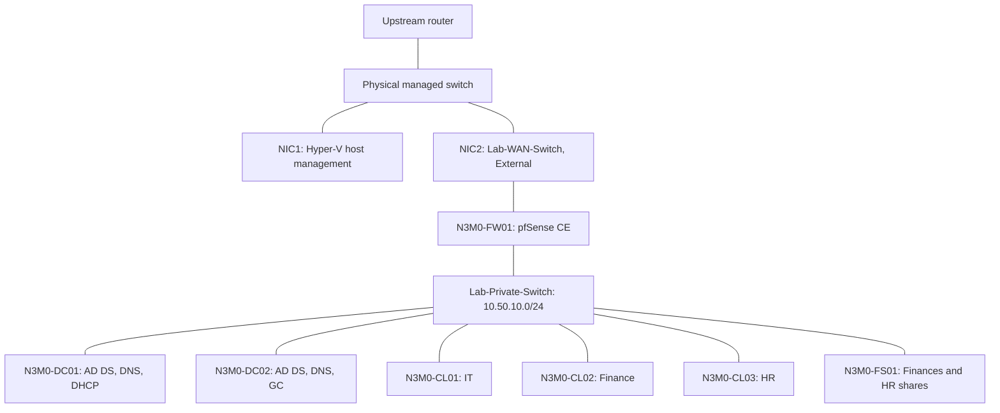

# Domain deployment architecture

Updated 2026-10-05. Results are based on session screenshots and operator reports.

## Deployed

Host sharing is disabled on Lab-WAN-Switch. NIC1 remains the host management connection; NIC2 is dedicated to the firewall uplink through the existing physical switch. No direct cable to the router was needed. Lab targets attach only to the private switch. Hyper-V console access remains available independently of guest IP connectivity.

## Address plan

| Device/purpose | Address | State |
|---|---|---|
| Lab network | 10.50.10.0/24; mask 255.255.255.0 | Deployed |
| N3M0-FW01 LAN / gateway | 10.50.10.1 | Configured |
| N3M0-FW01 WAN | DHCP on upstream network | Lease observed; not a static reservation |
| N3M0-DC01 | 10.50.10.10 | Configured |
| N3M0-DC02 | 10.50.10.11 | Deployed; replication verified |
| N3M0-FS01 | 10.50.10.20 | Configured per guided build/operator report |
| N3M0-CL01 | 10.50.10.100 | Observed DHCP lease |
| N3M0-CL02 | 10.50.10.101 | Observed DHCP lease |
| N3M0-CL03 | 10.50.10.102 | Observed DHCP lease |
| N3M0-Clients DHCP pool | 10.50.10.100–10.50.10.199 | Active; three client leases observed |

DC01 uses gateway 10.50.10.1 and preferred DNS 10.50.10.10, with alternate DNS blank. Its DNS forwarder is 10.50.10.1. Domain/forest: n3m0.test; NetBIOS: N3M0; functional levels: Windows Server 2025. The previously recorded guest IPv6 configuration remains enabled; the pfSense default IPv6 LAN allow rule is disabled.

## Firewall policy and validation

LAN rules, in order: anti-lockout; allow TCP/UDP DNS from LAN subnets to LAN address; block/log LAN traffic to PRIVATE_NETWORKS; default IPv4 allow; disabled default IPv6 allow. PRIVATE_NETWORKS contains 10.0.0.0/8, 172.16.0.0/12, and 192.168.0.0/16.

The DNS allowance must precede the private-address block. The block affects routed traffic and traffic to private firewall addresses unless explicitly allowed; it does not filter communication directly between guests in the same subnet.

DC01 external DNS and outbound TCP 443 passed. Firewall logs showed the test ICMP traffic from DC01 to the upstream router blocked by the named private-network rule. This is evidence for that tested path, not comprehensive segmentation or reverse-direction validation. Future inter-subnet services require explicit policy review.

## Resource plan

| Workload | vCPU | RAM | Disk | State |
|---|---:|---:|---:|---|
| N3M0-DC01 | 2 | 4 GB | 60 GB OS + 100 GB backup | Deployed |
| N3M0-FW01 | 2 | 4 GB fixed | 32 GB | Deployed following guided configuration |
| N3M0-DC02 | 2 | 4 GB | 80 GB guided | Deployed; sizing evidence in DC02 journal |
| N3M0-FS01 | 2 | 4 GB fixed | 80 GB OS + 70 GB data | Deployed; guided sizing |
| N3M0-CL01 (IT) | 2 | 4 GB | 80 GB | Deployed; guided sizing |
| N3M0-CL02 (Finance) | 2 | 4 GB | 80 GB | Deployed; guided sizing |
| N3M0-CL03 (HR) | 2 | 4 GB | 80 GB | Deployed; guided sizing |

All current project workloads run on the Hyper-V test server. Preserve retained ninjatest, VulScan, and Wazuh guests. Start workloads in phases and measure utilization. DC01's 2-vCPU correction was confirmed on 2026-09-10; older 20-vCPU observations are historical.

Penetration testing and endpoint monitoring are planned in a separate [follow-on project](project-series.md). They are outside this deployment architecture.

See [firewall and DHCP journal](firewall-dhcp-build.md) for settings, tests, and the next step.

## Active Directory organization

Under n3m0.test, N3M0-Lab contains Users (finance, hr, lchen, rafa), Admins (rafa-admin), Workstations (CL01–CL03), Servers (FS01), and Groups (including GG-Finance, GG-HR, GG-IT). Both DCs stay in the Domain Controllers OU. N3M0-Workstations-LogonNotice is linked to Workstations. The completed FS01 workflow adds a Servers OU for FS01 and domain-local groups DL-FS01-Finance-Modify and DL-FS01-HR-Modify containing the respective global departmental groups. These groups grant departmental file permissions; they do not create network segmentation. N3M0-Department-Drives is linked to Users and maps S: by user membership in GG-Finance or GG-HR. See [FS01 journal](fs01-build.md) for actual paths, permissions, and validation. See [client journal](windows-clients-build.md) for membership and validation details.

## DC02 and service redundancy — 2026-10-05

DC02 is a writable DNS/GC in the same site as DC01. Both-way directory and DNS replication and live Kerberos through DC02 passed. DHCP remains only on DC01; option 006 advertises 10.50.10.10 then 10.50.10.11, confirmed on CL01. DC02 uses DC01 plus local loopback DNS in the observed promotion configuration. DC01 uses only 10.50.10.10 after removing public resolvers. DC01 retains all FSMO roles and uses external NTP; DC02 follows DC01, with the guest Windows Time Hyper-V provider disabled on both. Both share one host; host failure and full DC outage failover are not covered. See [DC02 journal](dc02-build.md), including the unresolved DC01 local ADUC status label and pending housekeeping.
